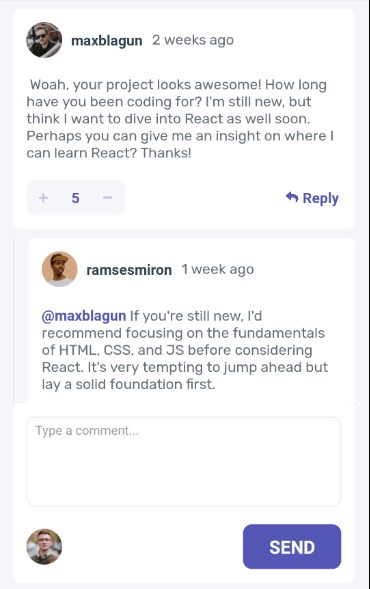
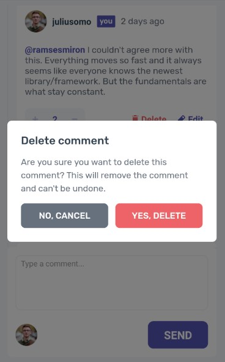
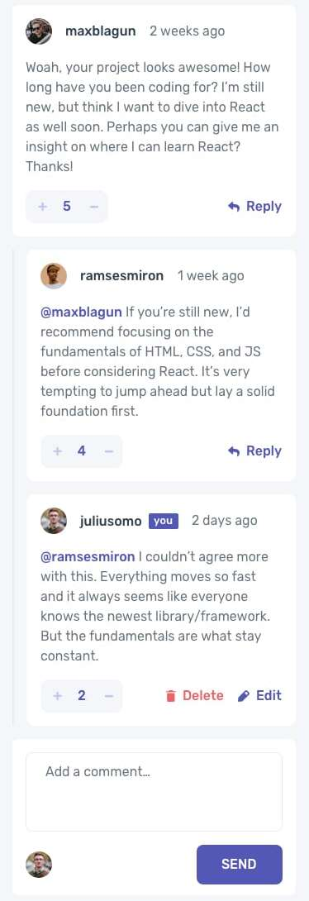

# Project 1

Your name(s): Katie Taylor, Kevin Hubbard

## Our App Design:
Here is our [design](./design/our-mobile-design.jpg) and [example of deleting a comment](./design/our-mobile-modal.jpg) in the design folder or below

Deleting a comment example:

## Code base

Instead of starting from scratch, you will start with a code base for this lab. The code base was revised from some code generated by ChatGPT. You can change anything in the code base to achieve the desired functionality and design. 

## Design

See [the expected design](./design/mobile-design.jpg) in the design folder. Your app should look as the following.

**Although it's not obvious from the above image, people's comment list and the comment input area should be separated into two different sections. People's comment list should be scrollable; the comment input area should be fixed at the bottom of the screen.** You may consider using a `FlatList` component to display the list of comments.

An example of deleting a comment is as following:

You may consider using a `Modal` component to display the delete confirmation dialog.

Please read more in [the style guide](./style-guide.md) about the specs of our design expectation. Please try your best to make your app look the same as the expected design. 

Last, you can find a set of icons and avatars in the `assets/image` folder. You can use them in designing your app.

## Functionality

Some of the raw data has been provided to you in the `assets/data` folder as a JSON file. You can use them to populate the app. You can add more datapoints to the JSON file if you want to. The `currentUser` represents "you" in the app. The `currentUser` is used to determine whether a comment is yours or not.

All buttons shown up in the design demo should be functional. The app should be able to perform the following operations:

* vote up/down a comment
* reply to a comment
* add a comment
* edit your comment
* delete your comment

In addition to the above operations, you should also implement the test cases to cover every component and every possible user interaction. A good starting point is to think about the above operations and how they can be triggered by the user. Currently, there is only 1 test case prepared under the `__test__` folder; you will need to add at least 5 more that covers the above operations.

## To do

When you finish, please do the following:

1. design and develop the application
1. add your tests to cover every component and every possible user interaction
1. commit and push your code
2. add your name to this README file (see above)
3. capture how your app looks locally in the simulated app on your machine
4. put the captured image in the design folder
5. edit this README file to display your captured image here in this README file (see the above displayed expected design as an example)