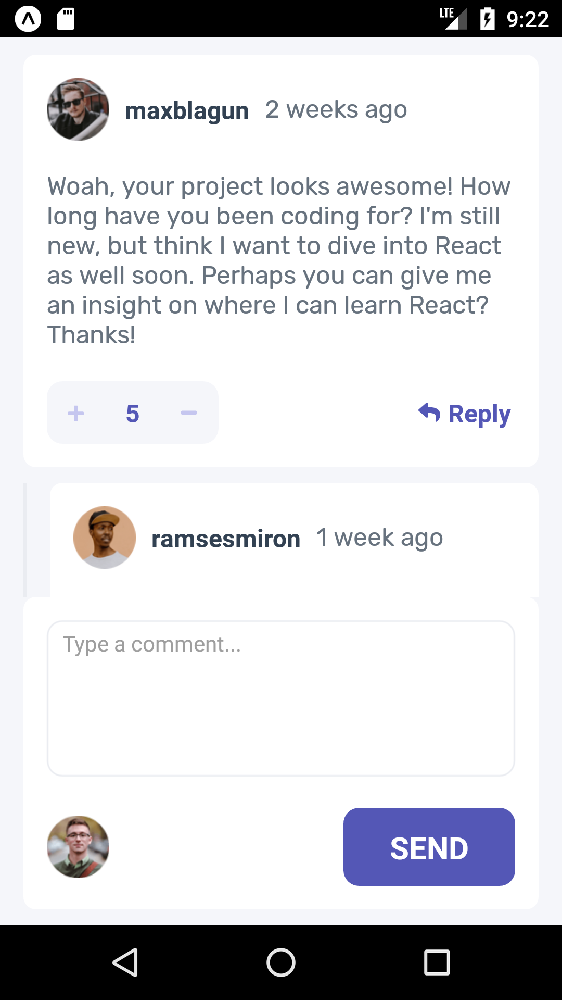
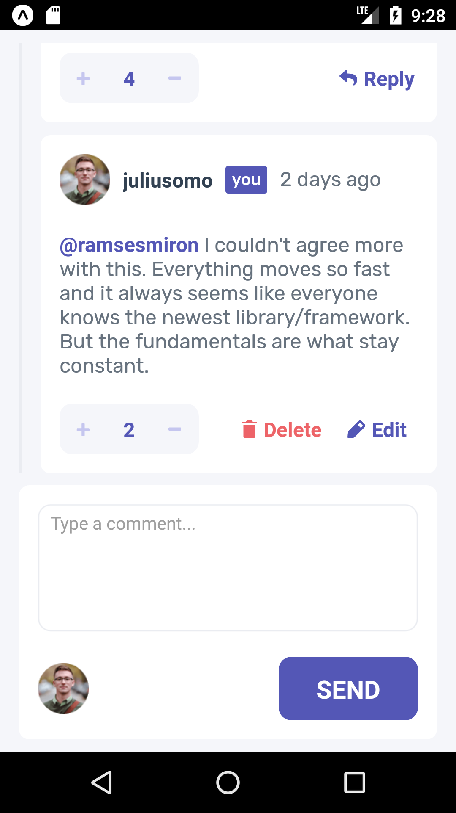

# Forum

Coded by: Katie Taylor & Kevin Hubbard

We developed a simple commenting app demo (like a mini-reddit) for our Mobile Development class at Western Washington University.

Run our app with expo with `npx expo start`, and connect to the Metro bundler with Expo Go or on your computer with an Android simulator/iOS emulator.

## Our App Design:
Our app UI looks like this, with a sticky comment input box and a scrollable comment list:

and this, after scrolling down the comments a little:

and this, when deleting a comment:

## Demo Functionality

In this demo, we pre-load sample JSON data.

Users can

* add a comment
* edit their comment
* delete their comment
* vote up/down others' comments
* reply to others' comments

## Testing

We automated testing of the aforementioned main functionality (commenting, editing comments, deleting comments, voting and replying) using Jest. It was a good challenge for us to learn how to test dynamically-created elements, which we had not done before.

You can run the Jest tests with `npm run test`.
